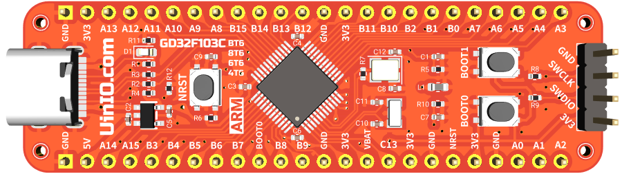
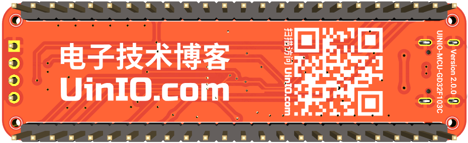

# UINIO-MCU-GD32F103CBT6 核心板

[**UINIO-MCU-GD32F103CBT6**](https://gitee.com/uinika/UINIO-MCU-GD32F103CBT6) 是一款基于 [**兆易创新**](https://www.gigadevice.com.cn/) 国产 **LQFP48** 封装的 **GD32F103Cxxx** 系列微控制器（`GD32F103CBT6`、`GD32F103C8T6`、`GD32F103C6T6`、`GD32F103C4T6`）的核心板电路设计，该微控制器基于 **ARM Cortex-M3** 内核架构，主频可以达到 `108MHz`，片上载有 `16K ~ 128K` 容量的 Flash 存储器，以及 `6K ~ 20K` 的 SRAM 存储器，并且拥有 2 到 3 组 `USART`、`I2C`、`SPI`，以及 1 到 2 组 `I2S`、`12 位 ADC`、`12 位 DAC`，同时支持 **USB 2.0 FS OTG** 协议，整体上属于外设资源比较完善的高性价比主控芯片产品。

## 核心板简介

1. 引出了 **GD32F103Cxxx** 芯片上的全部 GPIO 引脚资源；
2. **VSSA** 模拟地引脚使用了 `1KΩ 100Mhz` 的磁珠进行单点接地；
3. 单独提供有 4 线制 **SWD** 下载接口，便于快速与 **DAP-Link** 进行连接；
4. 使用 `8MHz` 与 `32.768KHz` 两枚贴片晶振，并且分别进行了简单的**包地**处理；
5. 主控芯片的 **USB 2.0 FS OTG** 被连接至 **USB Type-C** 接口，并且加入用于 USB 枚举的 `1.5 KΩ` 上拉电阻；

## 配套开发文档

对于 [UINIO-MCU-GD32F103CBT6](https://gitee.com/uinika/UINIO-MCU-GD32F103CBT6) 核心板的标准外设库开发，可以参考 [**UinIO.com 电子技术实验室**](https://www.uinio.com/) 里的专题文章 [《兆易创新 UINIO-MCU-GD32 标准库开发指南》](http://uinio.com/Project/UINIO-MCU-GD32/)，全文会不定期进行更新。
