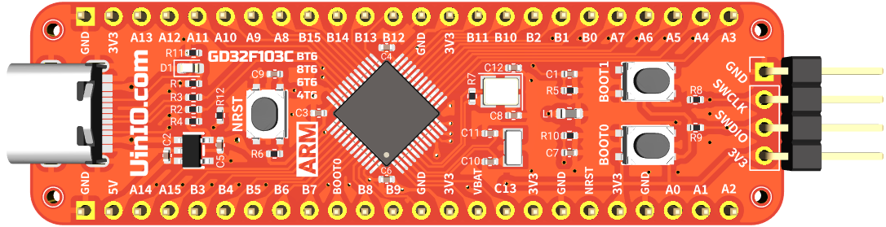

# UINIO-MCU-GD32F103C 评估板

这是一款基于 [**兆易创新**](https://www.gigadevice.com.cn/) 国产 **LQFP48** 封装 **GD32F103Cxxx** 系列微控制器（`GD32F103CBT6`、`GD32F103C8T6`、`GD32F103C6T6`、`GD32F103C4T6`）的评估板电路设计，该微控制器基于 **ARM Cortex-M3** 内核，主频达到了 `108MHz`，片上载有 `16K ~ 128K` 容量的 Flash 存储器，以及 `6K ~ 20K` 的 SRAM 存储器，并且拥有 2 到 3 组 `USART`、`I2C`、`SPI`，以及 1 到 2 组 `I2S`、`12 位 ADC`、`12 位 DAC`，同时依然支持 **USB 2.0 FS OTG**。

## 评估板简介

1. 引出了 **GD32F103Cxxx** 芯片上的全部 GPIO 引脚资源；
2. **VSSA** 模拟地引脚使用了 `1KΩ 100Mhz` 的磁珠进行单点接地；
3. 使用 `8MHz` 与 `32.768KHz` 两枚贴片晶振，并且分别进行了简单的**包地**处理；
4. 已经将 MCU 的 **USB 2.0 FS OTG** 连接至 USB Type-C 接口，并且加入用于 USB 枚举的 `1.5 KΩ` 上拉电阻，并且进行了**等长布线**；
5. 单独提供了 4 线制的 **SWD** 下载接口，便于调试的时候快速进行连接；
